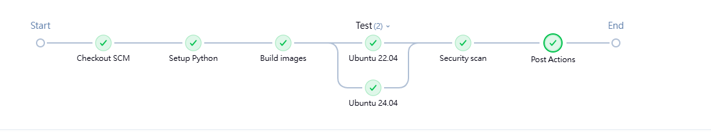
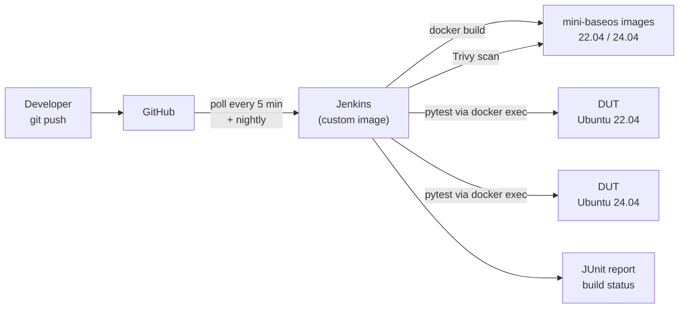
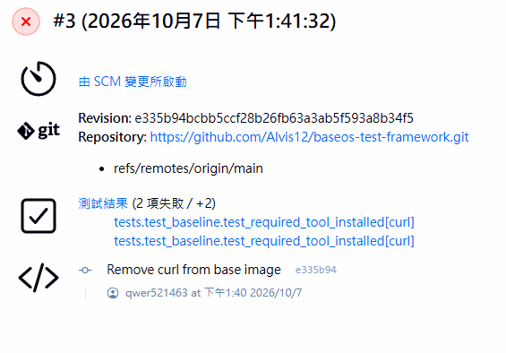
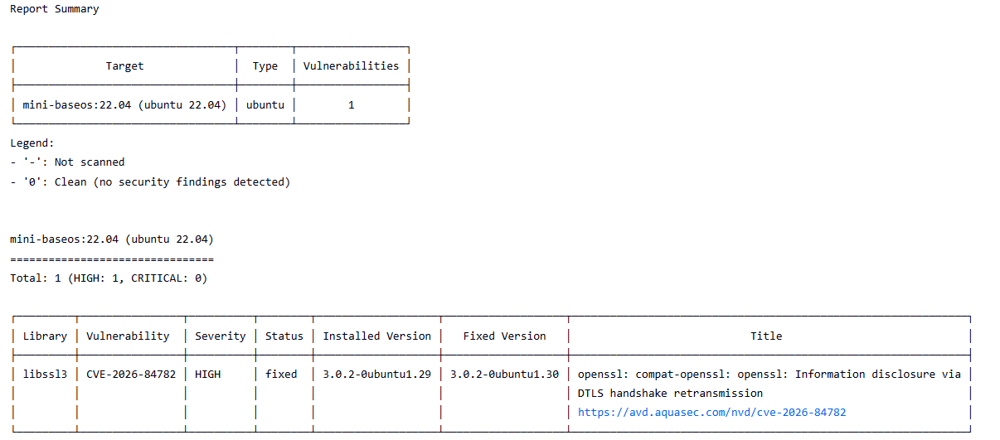

# BaseOS Test Automation Framework

An automated test framework that validates Linux BaseOS images against a system specification before release, using **pytest**, **Docker**, **Jenkins** and **Trivy**.

The project simulates how a server vendor would verify an operating system image (for example, the BaseOS shipped on a data-center server) every time it changes: build the image, check it against a spec on multiple OS versions in parallel, scan it for known vulnerabilities, and block the change if anything fails.



---

## Overview

| Component | Role |
|---|---|
| `baseos/Dockerfile` | The **product under test**: `mini-baseos`, a simplified server BaseOS built on Ubuntu 22.04 / 24.04 |
| `conftest.py` | Test harness: starts the device under test (DUT), runs commands inside it, tears it down |
| `tests/test_baseline.py` | The **system specification**, written as pytest checks |
| `Jenkinsfile` | CI pipeline: build → matrix test → vulnerability scan → report |
| `jenkins/Dockerfile` | Custom Jenkins image with Docker CLI and Python |
| `baseos/Dockerfile.broken` | Fault-injected image used to prove the tests actually catch failures |

## Architecture



Jenkins runs in its own container and talks to the host Docker daemon through `/var/run/docker.sock`. Test targets are started as **sibling containers**, so the test harness (Jenkins) and the system under test stay isolated from each other.

## What is checked

| Category | Check | How |
|---|---|---|
| Identity | OS is Ubuntu 22.04 or 24.04 | `/etc/os-release` |
| Required software | Python ≥ 3.10, `git`, `curl` installed | `python3`, `command -v` |
| Accounts | Service account `svc-app` exists and is not root | `id -u svc-app` |
| File security | `/etc/shadow` has no permissions for others | `stat -c %a` |
| File security (negative test) | `svc-app` **cannot** read `/etc/shadow` | read attempt as `svc-app` must fail |
| Configuration | Timezone is `Asia/Taipei` | `/etc/timezone` |
| Vulnerabilities | No fixable HIGH / CRITICAL CVEs | Trivy |

8 functional checks × 2 OS versions = **16 tests per build**, plus a vulnerability scan of each image.

## Pipeline

| Stage | What happens |
|---|---|
| Checkout | Jenkins pulls the latest commit from GitHub |
| Setup Python | Creates a virtual environment and installs pytest |
| Build images | Builds `mini-baseos:22.04` and `mini-baseos:24.04` from the same Dockerfile |
| Test (parallel) | Runs the spec against both versions at the same time (matrix testing) |
| Security scan | Trivy scans both images; fails on fixable HIGH / CRITICAL CVEs |
| Post | Publishes JUnit results to Jenkins, whether the build passed or failed |

**Triggers:** SCM polling every 5 minutes, plus a nightly run. The nightly run matters even when no code changes, because new CVEs are published every day.

## Results

### Regression caught automatically

A commit removed `curl` from the base image. Jenkins detected the change by itself, ran the suite, and failed the build on both OS versions, pointing directly at the offending commit. Reverting the commit turned the build green again without any manual trigger.



### Real vulnerability found

When the Trivy stage was added, it immediately flagged a **HIGH-severity OpenSSL (`libssl3`) vulnerability** in the Ubuntu 22.04 image that already had a patched version available. The root cause was that the Dockerfile installed new packages but never upgraded packages that came with the base image. Adding `apt-get upgrade` to the build fixed it, and the next build passed.



| Build | Trigger | Result | What happened |
|---|---|---|---|
| #3 | SCM change | ❌ | `curl` removed → 2 spec violations detected |
| #4 | SCM change | ✅ | Revert verified automatically |
| #5 | SCM change | ❌ | Trivy found a fixable HIGH CVE in 22.04 |
| #6 | SCM change | ✅ | Security updates applied, re-verified |

## Design decisions

**Device-under-test abstraction.** Every check goes through `Target.run()`, which currently executes commands with `docker exec`. Swapping the implementation for SSH lets the same test suite run against physical servers with no changes to the test cases.

**Tests must be able to fail.** `Dockerfile.broken` injects three faults (world-readable `/etc/shadow`, missing `curl`, wrong timezone). All three are caught, which proves the suite detects real problems instead of passing by default.

**Tests must not leak secrets.** An early version printed the contents of `/etc/shadow` into the failure log. The check now discards output and only inspects the return code, so CI logs never contain password hashes.

**Avoiding alert fatigue.** The scan uses `--ignore-unfixed`: only vulnerabilities with an available fix fail the build. A red build always means there is something actionable to do.

**Report everything before failing.** The scan loop records failures and exits at the end, so every OS version is scanned even if an earlier one fails.

**Fast feedback.** Docker layer caching brings an unchanged build from ~6.5 minutes down to under 10 seconds.

## Project structure

```
baseos-test-framework/
├── baseos/
│   ├── Dockerfile           # mini-baseos (product under test)
│   └── Dockerfile.broken    # fault-injected image
├── jenkins/
│   └── Dockerfile           # Jenkins + Docker CLI + Python
├── tests/
│   └── test_baseline.py     # system specification
├── conftest.py              # DUT fixture and command runner
└── Jenkinsfile              # CI pipeline
```

## Running locally

**Requirements:** Linux or WSL2, Docker, Python 3.10+

```bash
# Build the images
docker build -t mini-baseos:24.04 baseos/
docker build --build-arg UBUNTU_VERSION=22.04 -t mini-baseos:22.04 baseos/

# Run the tests
python3 -m venv .venv
source .venv/bin/activate
pip install pytest
pytest -v --image mini-baseos:24.04
pytest -v --image mini-baseos:22.04

# Prove the tests catch failures
docker build -f baseos/Dockerfile.broken -t mini-baseos:broken baseos/
pytest --image mini-baseos:broken    # expected: 4 failed, 4 passed

# Vulnerability scan
docker run --rm -v /var/run/docker.sock:/var/run/docker.sock \
  aquasec/trivy:latest image --severity HIGH,CRITICAL --ignore-unfixed mini-baseos:22.04
```

## Running Jenkins

```bash
# Build the custom Jenkins image
docker build -t my-jenkins jenkins/

# Find the group that owns the Docker socket (as seen from a container)
docker run --rm -v /var/run/docker.sock:/var/run/docker.sock alpine stat -c %g /var/run/docker.sock

# Start Jenkins (replace 1001 with the number printed above)
docker run -d --name jenkins -p 8081:8080 -p 50000:50000 \
  -v jenkins_home:/var/jenkins_home \
  -v /var/run/docker.sock:/var/run/docker.sock \
  --group-add 1001 \
  my-jenkins
```

Then open `http://localhost:8081`, create a **Pipeline** job using **Pipeline script from SCM**, point it at this repository, and set the branch to `*/main`.

## Limitations and roadmap

- **Userland only.** Containers share the host kernel, so this setup validates the OS userland (packages, accounts, permissions, configuration). Kernel, driver, firmware and hardware checks require a physical target.
- **Physical hardware target.** Add an SSH implementation of `Target` to run the same suite against a real server (planned: NVIDIA DGX Spark), plus GPU / driver / CUDA checks using `nvidia-smi`, skipped automatically when no GPU is present.
- **Webhooks instead of polling** once Jenkins is reachable from GitHub.
- **Dedicated build agents** instead of sharing the Docker socket with the Jenkins controller, which grants root-equivalent access to the host.
- **Custom CVE checks** in pytest, comparing installed package versions against public vulnerability databases.
